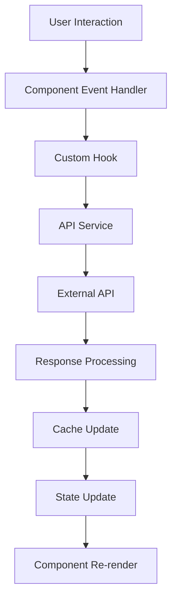
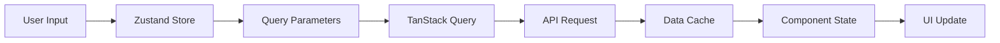
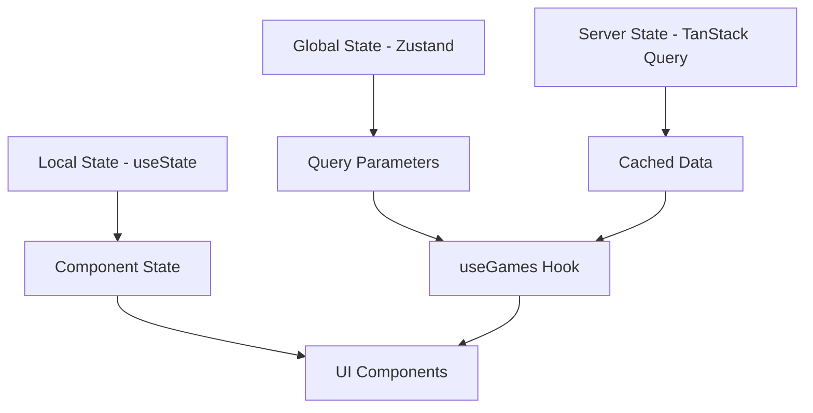
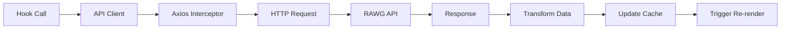
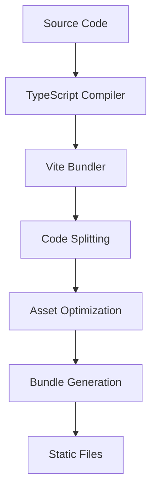
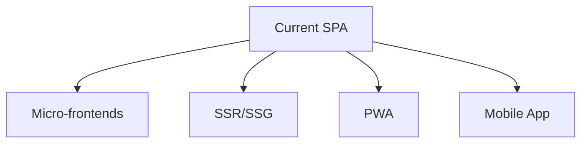

# Architecture Overview

This document provides a comprehensive overview of the Game Hub application architecture, design patterns, and system organization.

## Table of Contents

- [System Overview](#system-overview)
- [Application Architecture](#application-architecture)
- [Frontend Architecture](#frontend-architecture)
- [Data Flow](#data-flow)
- [Component Architecture](#component-architecture)
- [State Management](#state-management)
- [API Integration Layer](#api-integration-layer)
- [Routing Architecture](#routing-architecture)
- [Build Architecture](#build-architecture)
- [Performance Architecture](#performance-architecture)
- [Security Architecture](#security-architecture)
- [Scalability Considerations](#scalability-considerations)

## System Overview

Game Hub is a modern single-page application (SPA) built with React and TypeScript, designed to provide users with a comprehensive game discovery platform. The application follows a client-side architecture that integrates with external APIs to deliver a rich, interactive experience.

### High-Level Architecture

```
┌─────────────────┐    ┌──────────────────┐    ┌─────────────────┐
│   User Browser  │    │   Game Hub SPA   │    │   RAWG API      │
│                 │    │                  │    │                 │
│  ┌───────────┐  │    │  ┌────────────┐  │    │  ┌───────────┐  │
│  │    UI     │  │◄───│  │ React App  │  │◄───│  │ Game Data │  │
│  └───────────┘  │    │  └────────────┘  │    │  └───────────┘  │
│                 │    │                  │    │                 │
│  ┌───────────┐  │    │  ┌────────────┐  │    │                 │
│  │ Browser   │  │    │  │ Service    │  │    │                 │
│  │ Storage   │  │    │  │ Layer      │  │    │                 │
│  └───────────┘  │    │  └────────────┘  │    │                 │
└─────────────────┘    └──────────────────┘    └─────────────────┘
```

### Technology Stack

| Layer | Technology | Purpose |
|-------|------------|---------|
| **UI Framework** | React 19 | Component-based user interface |
| **Type System** | TypeScript | Type safety and developer experience |
| **Build Tool** | Vite | Fast development and optimized builds |
| **UI Library** | Chakra UI v3 | Design system and components |
| **State Management** | Zustand | Lightweight global state |
| **Data Fetching** | TanStack Query | Server state management |
| **Routing** | React Router | Client-side navigation |
| **HTTP Client** | Axios | API communication |

## Application Architecture

### Architectural Patterns

1. **Component-Based Architecture**: Modular, reusable UI components
2. **Unidirectional Data Flow**: Predictable state updates
3. **Service Layer Pattern**: Abstracted API interactions
4. **Hook-Based Logic**: Reusable business logic
5. **Responsive Design**: Mobile-first approach

### Core Principles

- **Separation of Concerns**: Clear boundaries between UI, logic, and data
- **Single Responsibility**: Each component/module has one clear purpose
- **Dependency Injection**: Loose coupling through props and context
- **Immutability**: Immutable state updates for predictability
- **Type Safety**: TypeScript for compile-time error detection

## Frontend Architecture

### Directory Structure

```
src/
├── assets/                 # Static assets
│   ├── images/
│   └── icons/
├── components/             # Reusable UI components
│   ├── ui/                # Base UI components
│   ├── GameCard/          # Feature-specific components
│   ├── SearchBox/
│   └── index.ts           # Barrel exports
├── hooks/                 # Custom React hooks
│   ├── useGames.ts        # Data fetching hooks
│   ├── useGame.ts
│   └── useLocalStorage.ts # Utility hooks
├── pages/                 # Route-level components
│   ├── HomePage/
│   ├── GameDetailsPage/
│   └── ErrorPage/
├── services/              # External service integrations
│   ├── api-client.ts      # Generic API client
│   ├── rawg-api.ts        # RAWG-specific API calls
│   └── image-service.ts   # Image processing
├── entities/              # TypeScript type definitions
│   ├── Game.ts
│   ├── Genre.ts
│   └── Platform.ts
├── utils/                 # Utility functions
│   ├── helpers.ts
│   └── constants.ts
├── store/                 # Global state management
│   └── gameStore.ts
├── routes.tsx             # Routing configuration
├── theme.ts              # UI theme configuration
└── main.tsx              # Application entry point
```

### Layer Responsibilities

#### Presentation Layer (Components)
- **Purpose**: User interface rendering and interaction
- **Responsibilities**:
  - Render UI elements
  - Handle user events
  - Manage local component state
  - Display loading and error states

#### Business Logic Layer (Hooks)
- **Purpose**: Encapsulate business rules and data operations
- **Responsibilities**:
  - Data fetching and caching
  - State management
  - Business rule enforcement
  - Side effect management

#### Service Layer (Services)
- **Purpose**: External system integration
- **Responsibilities**:
  - API communication
  - Data transformation
  - Error handling
  - Response processing

#### Data Layer (Entities/Types)
- **Purpose**: Data modeling and type definitions
- **Responsibilities**:
  - Type definitions
  - Data validation
  - Interface contracts

## Data Flow

### Request Flow



### State Flow



### Data Flow Examples

#### Game Search Flow
```typescript
// 1. User types in search box
const SearchBox = () => {
  const { setSearchText } = useGameQueryStore();
  
  const handleSearch = (text: string) => {
    setSearchText(text); // Updates global state
  };
};

// 2. Search triggers new query
const GameGrid = () => {
  const { gameQuery } = useGameQueryStore();
  const { data, isLoading } = useGames(gameQuery); // Reactive to state changes
};

// 3. Hook fetches data with new parameters
const useGames = (gameQuery: GameQuery) => {
  return useInfiniteQuery({
    queryKey: ['games', gameQuery],
    queryFn: ({ pageParam = 1 }) => apiClient.getAll({
      params: { search: gameQuery.searchText, page: pageParam }
    })
  });
};
```

## Component Architecture

### Component Hierarchy

```
App
├── Layout
│   ├── NavBar
│   │   ├── Logo
│   │   ├── SearchBox
│   │   └── ColorModeSwitch
│   └── Outlet (React Router)
│       ├── HomePage
│       │   ├── GenreList
│       │   ├── PlatformSelector
│       │   ├── SortSelector
│       │   └── GameGrid
│       │       └── GameCard[]
│       └── GameDetailsPage
│           ├── GameAttributes
│           ├── ExpandableText
│           ├── GameScreenshots
│           └── GameTrailers
└── ErrorBoundary
```

### Component Types

#### 1. Layout Components
```typescript
// Layout components structure the application
const Layout = () => (
  <>
    <NavBar />
    <Box padding={5}>
      <Outlet /> {/* Route content */}
    </Box>
  </>
);
```

#### 2. Page Components
```typescript
// Page components represent routes
const HomePage = () => {
  const { gameQuery } = useGameQueryStore();
  const { data, isLoading } = useGames(gameQuery);

  return (
    <Grid templateAreas={gridTemplateAreas}>
      <GridItem area="aside">
        <GenreList />
      </GridItem>
      <GridItem area="main">
        <GameGrid games={data} loading={isLoading} />
      </GridItem>
    </Grid>
  );
};
```

#### 3. Feature Components
```typescript
// Feature components encapsulate specific functionality
const GameCard = ({ game }: { game: Game }) => {
  const navigate = useNavigate();

  return (
    <Card onClick={() => navigate(`/games/${game.slug}`)}>
      <GameImage src={game.background_image} alt={game.name} />
      <CardBody>
        <GameTitle>{game.name}</GameTitle>
        <CriticScore score={game.metacritic} />
        <PlatformIconList platforms={game.platforms} />
      </CardBody>
    </Card>
  );
};
```

#### 4. UI Components
```typescript
// Reusable UI components
const CriticScore = ({ score }: { score: number }) => {
  const color = score > 75 ? 'green' : score > 60 ? 'yellow' : 'red';

  return (
    <Badge colorPalette={color} fontSize="14px" paddingX={2}>
      {score}
    </Badge>
  );
};
```

### Component Design Patterns

#### 1. Compound Components
```typescript
const GameCard = {
  Root: ({ children, ...props }) => <Card {...props}>{children}</Card>,
  Image: ({ src, alt }) => <GameImage src={src} alt={alt} />,
  Body: ({ children }) => <CardBody>{children}</CardBody>,
  Title: ({ children }) => <Heading size="md">{children}</Heading>,
  Meta: ({ children }) => <HStack>{children}</HStack>,
};

// Usage
<GameCard.Root>
  <GameCard.Image src={game.image} alt={game.name} />
  <GameCard.Body>
    <GameCard.Title>{game.name}</GameCard.Title>
    <GameCard.Meta>
      <CriticScore score={game.score} />
      <PlatformList platforms={game.platforms} />
    </GameCard.Meta>
  </GameCard.Body>
</GameCard.Root>
```

#### 2. Render Props Pattern
```typescript
const DataLoader = ({ children, ...queryProps }) => {
  const query = useQuery(queryProps);
  
  return children({
    data: query.data,
    loading: query.isLoading,
    error: query.error,
    refetch: query.refetch,
  });
};

// Usage
<DataLoader queryKey={['games']} queryFn={fetchGames}>
  {({ data, loading, error }) => {
    if (loading) return <Spinner />;
    if (error) return <ErrorMessage error={error} />;
    return <GameGrid games={data} />;
  }}
</DataLoader>
```

## State Management

### State Architecture



### Global State (Zustand)

```typescript
// store/gameStore.ts
interface GameQueryStore {
  gameQuery: GameQuery;
  setSearchText: (searchText: string) => void;
  setGenreId: (genreId: number) => void;
  setPlatformId: (platformId: number) => void;
  setSortOrder: (sortOrder: string) => void;
}

const useGameQueryStore = create<GameQueryStore>((set) => ({
  gameQuery: {},
  
  setSearchText: (searchText) => 
    set(() => ({ gameQuery: { searchText } })),
    
  setGenreId: (genreId) =>
    set((store) => ({ 
      gameQuery: { ...store.gameQuery, genreId } 
    })),
    
  // ... other setters
}));
```

### Server State (TanStack Query)

```typescript
// Query client configuration
const queryClient = new QueryClient({
  defaultOptions: {
    queries: {
      staleTime: 1000 * 60 * 5,        // 5 minutes
      cacheTime: 1000 * 60 * 10,       // 10 minutes
      retry: 3,
      refetchOnWindowFocus: false,
    },
  },
});

// Query hooks
const useGames = (gameQuery: GameQuery) =>
  useInfiniteQuery({
    queryKey: ['games', gameQuery],
    queryFn: ({ pageParam = 1 }) => fetchGames(gameQuery, pageParam),
    getNextPageParam: (lastPage) => lastPage.next ? lastPage.page + 1 : undefined,
  });
```

### State Boundaries

1. **Global State**: User preferences, query parameters
2. **Server State**: API data, cached responses
3. **Local State**: Component-specific UI state
4. **URL State**: Route parameters, search params

## API Integration Layer

### Service Architecture

```typescript
// Generic API client
class APIClient<T> {
  constructor(private endpoint: string) {}

  getAll = (config?: AxiosRequestConfig) =>
    axiosInstance.get<FetchResponse<T>>(this.endpoint, config)
      .then(res => res.data);

  get = (id: number | string) =>
    axiosInstance.get<T>(`${this.endpoint}/${id}`)
      .then(res => res.data);
}

// Service instances
const gamesService = new APIClient<Game>('/games');
const genresService = new APIClient<Genre>('/genres');
const platformsService = new APIClient<Platform>('/platforms');
```

### Request/Response Pipeline



### Error Handling Strategy

```typescript
// Centralized error handling
const apiErrorHandler = (error: AxiosError) => {
  if (error.response?.status === 404) {
    throw new NotFoundError('Resource not found');
  }
  if (error.response?.status === 429) {
    throw new RateLimitError('Rate limit exceeded');
  }
  throw new APIError(error.message);
};

// Hook error boundaries
const useGames = (gameQuery: GameQuery) => {
  return useInfiniteQuery({
    queryKey: ['games', gameQuery],
    queryFn: fetchGames,
    onError: (error) => {
      console.error('Failed to fetch games:', error);
      // Could trigger error reporting here
    },
  });
};
```

## Routing Architecture

### Route Structure

```typescript
// routes.tsx
const router = createBrowserRouter([
  {
    path: '/',
    element: <Layout />,
    errorElement: <ErrorPage />,
    children: [
      {
        index: true,
        element: <HomePage />,
      },
      {
        path: 'games/:slug',
        element: <GameDetailsPage />,
        loader: ({ params }) => ({ slug: params.slug }),
      },
    ],
  },
]);
```

### Navigation Patterns

```typescript
// Programmatic navigation
const useGameNavigation = () => {
  const navigate = useNavigate();

  const goToGame = (slug: string) => {
    navigate(`/games/${slug}`);
  };

  const goToHome = () => {
    navigate('/');
  };

  return { goToGame, goToHome };
};

// Link-based navigation with prefetching
const GameCard = ({ game }: { game: Game }) => {
  const queryClient = useQueryClient();

  const handleMouseEnter = () => {
    // Prefetch game details on hover
    queryClient.prefetchQuery({
      queryKey: ['games', game.slug],
      queryFn: () => fetchGameDetails(game.slug),
    });
  };

  return (
    <Link to={`/games/${game.slug}`} onMouseEnter={handleMouseEnter}>
      {/* Card content */}
    </Link>
  );
};
```

## Build Architecture

### Build Pipeline



### Build Configuration

```typescript
// vite.config.ts
export default defineConfig({
  plugins: [react(), tsconfigPaths()],
  build: {
    target: 'es2020',
    outDir: 'dist',
    sourcemap: false,
    rollupOptions: {
      output: {
        manualChunks: {
          vendor: ['react', 'react-dom'],
          ui: ['@chakra-ui/react'],
          router: ['react-router-dom'],
          query: ['@tanstack/react-query'],
        },
      },
    },
  },
  optimizeDeps: {
    include: ['react', 'react-dom'],
  },
});
```

### Asset Processing

```typescript
// Image optimization
const getCroppedImageUrl = (url: string) => {
  if (!url) return noImagePlaceholder;
  
  const target = 'media/';
  const index = url.indexOf(target) + target.length;
  return url.slice(0, index) + 'crop/600/400/' + url.slice(index);
};

// Dynamic imports for code splitting
const GameDetailsPage = lazy(() => 
  import('./pages/GameDetailsPage').then(module => ({
    default: module.GameDetailsPage
  }))
);
```

## Performance Architecture

### Performance Strategies

1. **Code Splitting**: Route-based and component-based
2. **Lazy Loading**: Components and images
3. **Caching**: Query caching and browser caching
4. **Virtualization**: Large lists (if needed)
5. **Prefetching**: Predictive data loading

### Optimization Techniques

```typescript
// Memoization for expensive computations
const GameGrid = memo(({ games }: { games: Game[] }) => {
  const sortedGames = useMemo(() => 
    games.sort((a, b) => b.metacritic - a.metacritic),
    [games]
  );

  return (
    <Grid>
      {sortedGames.map(game => (
        <GameCard key={game.id} game={game} />
      ))}
    </Grid>
  );
});

// Intersection Observer for infinite scroll
const useInfiniteScroll = (callback: () => void) => {
  const ref = useRef<HTMLDivElement>(null);

  useEffect(() => {
    const observer = new IntersectionObserver(([entry]) => {
      if (entry.isIntersecting) {
        callback();
      }
    });

    if (ref.current) {
      observer.observe(ref.current);
    }

    return () => observer.disconnect();
  }, [callback]);

  return ref;
};
```

### Bundle Analysis

```bash
# Analyze bundle size
npm run build -- --analyze

# Output structure
dist/
├── assets/
│   ├── vendor-[hash].js      # Third-party libraries
│   ├── ui-[hash].js         # UI components
│   ├── router-[hash].js     # Routing logic
│   └── index-[hash].js      # Main application
```

## Security Architecture

### Security Measures

1. **Environment Variables**: Secure API key management
2. **HTTPS Only**: All API communications over HTTPS
3. **Content Security Policy**: XSS protection
4. **Input Validation**: Sanitized user inputs
5. **Dependency Scanning**: Regular security updates

### Implementation

```typescript
// Environment variable validation
const config = {
  apiKey: import.meta.env.VITE_RAWG_API_KEY,
  apiBaseUrl: import.meta.env.VITE_API_BASE_URL,
};

if (!config.apiKey) {
  throw new Error('VITE_RAWG_API_KEY environment variable is required');
}

// Input sanitization
const sanitizeSearchInput = (input: string): string => {
  return input.trim().replace(/[<>]/g, '');
};

// CSP headers (configured at deployment level)
const cspConfig = {
  'default-src': "'self'",
  'script-src': "'self' 'unsafe-inline'",
  'style-src': "'self' 'unsafe-inline'",
  'img-src': "'self' data: https:",
  'connect-src': "'self' https://api.rawg.io",
};
```

## Scalability Considerations

### Current Scale
- **Users**: Optimized for thousands of concurrent users
- **Data**: Handles large game datasets efficiently
- **Performance**: Sub-second load times

### Future Scalability

1. **Horizontal Scaling**: CDN distribution
2. **Caching Strategy**: Multi-layer caching
3. **Code Splitting**: Granular bundle splitting
4. **Service Workers**: Offline capability
5. **Performance Monitoring**: Real-time metrics

### Architecture Evolution



### Monitoring Architecture

```typescript
// Performance monitoring
const trackPageLoad = () => {
  if ('performance' in window) {
    const navigation = performance.getEntriesByType('navigation')[0];
    const loadTime = navigation.loadEventEnd - navigation.fetchStart;
    
    // Send metrics to analytics service
    analytics.track('page_load_time', { duration: loadTime });
  }
};

// Error tracking
const trackError = (error: Error, context: string) => {
  errorReporting.captureException(error, {
    tags: { context },
    extra: { userAgent: navigator.userAgent },
  });
};
```

## Design Patterns Summary

### Implemented Patterns

1. **Observer Pattern**: Event-driven updates
2. **Factory Pattern**: API client instantiation
3. **Singleton Pattern**: Query client instance
4. **Strategy Pattern**: Multiple sorting strategies
5. **Facade Pattern**: Simplified API interfaces
6. **Decorator Pattern**: Higher-order components

### Anti-patterns Avoided

1. **Prop Drilling**: Use of context and global state
2. **Tightly Coupled Components**: Loose coupling through props
3. **God Components**: Single responsibility principle
4. **Direct DOM Manipulation**: React's declarative approach
5. **Synchronous Operations**: Async/await patterns

This architecture provides a solid foundation for a scalable, maintainable, and performant game discovery platform while following React and TypeScript best practices.