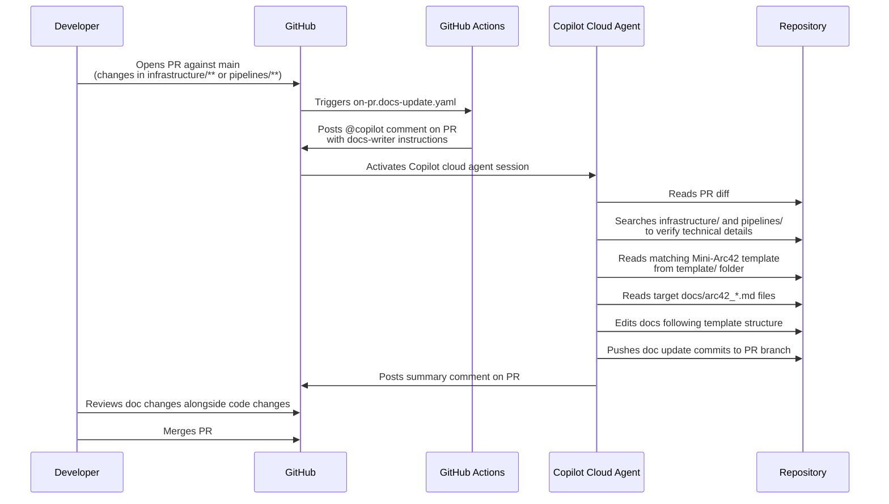
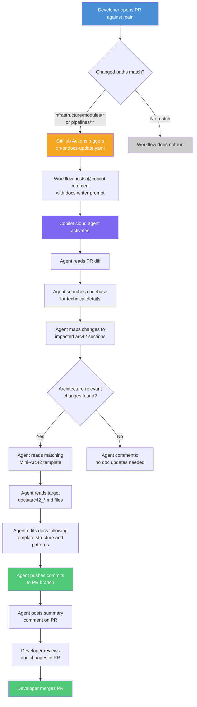
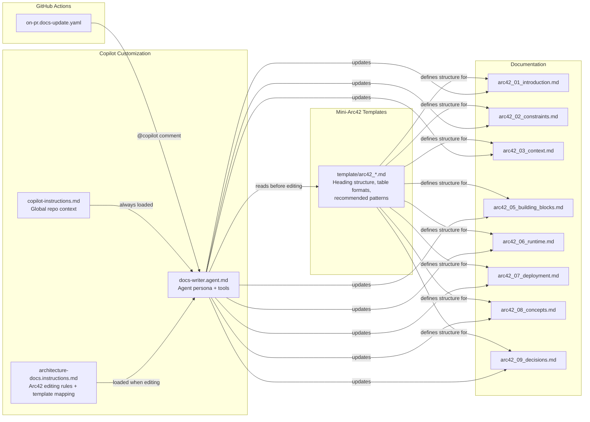

# Docs-Writer Agent — Full Flow Documentation

## Overview

The **docs-writer** system automatically updates arc42 architecture documentation whenever infrastructure or pipeline changes are introduced via a pull request. It combines a GitHub Actions workflow with the GitHub Copilot cloud agent to keep documentation aligned with code — without manual effort from developers.

## Components

| Component | File | Purpose |
|-----------|------|---------|
| **Trigger Workflow** | `.github/workflows/on-pr.docs-update.yaml` | Fires on PR creation; posts an `@copilot` comment to activate the cloud agent |
| **Docs-Writer Agent** | `.github/agents/docs-writer.agent.md` | Custom Copilot agent persona with scoped tools and arc42-specific instructions |
| **Workspace Instructions** | `.github/copilot-instructions.md` | Global repo context loaded into every Copilot session (repo structure, rules, doc targets) |
| **File Instructions** | `.github/instructions/architecture-docs.instructions.md` | Automatically attached when Copilot edits `docs/arc42_*.md` files (heading style, template-to-doc mapping) |
| **Mini-Arc42 Templates** | `template/arc42_*.md` | 8 template files defining the heading structure, table formats, recommended patterns, and guidance for each arc42 section |
| **Arc42 Docs** | `docs/arc42_*.md` | The 8 architecture documentation files that get updated |

## End-to-End Flow

### Sequence Diagram

### Flow Diagram

## Trigger Details

### Workflow: `on-pr.docs-update.yaml`

| Setting | Value | Rationale |
|---------|-------|-----------|
| **Event** | `pull_request` | Fires on PR lifecycle events |
| **Types** | `[opened]` | Only on PR creation — avoids noise on every push |
| **Branches** | `main` | Only PRs targeting the main branch |
| **Paths** | `infrastructure/modules/datapools/**` `infrastructure/modules/shared_resources/**` `pipelines/**` | Only when infra or pipeline code changes — skips doc-only or script-only PRs |
| **Runner** | `ubuntu-latest` | Lightweight — only needs to post a comment |
| **Permissions** | `contents: read`, `pull-requests: write` | Minimal — no Azure credentials, no `id-token` |

### What the workflow does NOT do

- It does NOT run Terraform or access Azure
- It does NOT modify any files directly
- It does NOT block or gate the PR merge
- It only posts a comment — Copilot cloud agent does the actual work

## Agent Details

### Docs-Writer Agent: `docs-writer.agent.md`

| Setting | Value | Rationale |
|---------|-------|-----------|
| **Tools** | `[read, edit, search]` | Minimal — no terminal, no web access |
| **Discovery** | Keyword-rich `description` with "Use when..." pattern | Enables subagent delegation and manual invocation |

### Agent Workflow (7 steps)

1. **Read** the PR description or feature context to understand what changed
2. **Search** the codebase (`infrastructure/`, `pipelines/`) to verify technical details
3. **Map** changes to impacted arc42 sections
4. **Read template** — read the matching Mini-Arc42 template in `template/` to understand the expected heading structure, table formats, and recommended patterns
5. **Read docs** — read the target `docs/arc42_*.md` file(s) to understand existing content
6. **Edit** following the template structure — preserve existing headings, use template table formats, apply MADR format for decisions
7. **Summarize** what was updated in a follow-up comment

### Agent Constraints

- Will NOT invent unsupported technical facts
- Will NOT remove existing documentation
- Will NOT create new doc files
- Will NOT add implementation details that belong in code comments
- Will NOT deviate from Mini-Arc42 template heading structure
- Will ONLY write Markdown

## Documentation Targets

The agent updates these files based on the nature of the change:

| File | Section Focus | Example Triggers |
|------|--------------|------------------|
| `docs/arc42_01_introduction.md` | Purpose, scope, stakeholders | New service added, scope expansion |
| `docs/arc42_02_constraints.md` | Technical/organizational constraints | New compliance rule, tech limitation |
| `docs/arc42_03_context.md` | System context, external interfaces | New external dependency, API integration |
| `docs/arc42_05_building_blocks.md` | Components, responsibilities | New module, component refactor |
| `docs/arc42_06_runtime.md` | Runtime scenarios, data flows | New event flow, processing pipeline |
| `docs/arc42_07_deployment.md` | Infrastructure, environments | New resource, environment change |
| `docs/arc42_08_concepts.md` | Cross-cutting patterns | New naming convention, security pattern |
| `docs/arc42_09_decisions.md` | Architecture decisions | Technology choice, design trade-off |

## Customization & Template Layer

Three layers provide context to Copilot when it works on docs:

### `.github/copilot-instructions.md` (always loaded)
- Repository-wide context: IaC + Terraform + arc42
- Global rules: follow Mini-Arc42 templates, use MADR for decisions
- Full list of documentation targets with purpose
- Repository directory structure map

### `.github/instructions/architecture-docs.instructions.md` (loaded when editing `docs/arc42_*.md`)
- Explicit template-to-doc mapping (e.g., `template/arc42_07_deployment.md` → `docs/arc42_07_deployment.md`)
- Requirement to read the matching template before each edit
- Style preferences (short sections, bullets, factual)
- Recommended sections: Change Summary, Affected Components, Interface Impact, etc.

### `template/arc42_*.md` — Mini-Arc42 Templates (read by agent before edits)
The 8 template files define the **canonical structure** for each arc42 section:

| Template | Defines |
|----------|--------|
| `template/arc42_01_introduction.md` | Requirements Overview, Quality Goals (ISO 25010 reference), Stakeholders table |
| `template/arc42_02_constraints.md` | Technical, Organizational, Political constraints; Conventions (table format) |
| `template/arc42_03_context.md` | Business Context (diagram + table), Technical Context (protocols, channels) |
| `template/arc42_05_building_blocks.md` | Hierarchical decomposition (Level 1–3), White Box template, interface tables |
| `template/arc42_06_runtime.md` | Key scenario selection criteria, sequence diagram format, PlantUML examples |
| `template/arc42_07_deployment.md` | Infrastructure overview diagram, node specification template, environment details |
| `template/arc42_08_concepts.md` | Domain model, cross-cutting concept categories (security, logging, patterns) |
| `template/arc42_09_decisions.md` | MADR format, ADR naming convention `[Context/Prefix] ADRNNN - Short Title` |

## Configuration Diagram

## Prerequisites

Before this automation works, ensure:

1. **Copilot cloud agent is enabled** — org admin must enable it under Copilot policies
2. **Repository is not opted out** — repo owner must not have disabled Copilot cloud agent
3. **Branch protection allows Copilot** — if rulesets restrict commit authors, add Copilot as a bypass actor
4. **GitHub Actions is enabled** — the workflow needs to run to post the trigger comment

## Cost

| Resource | Consumption |
|----------|-------------|
| **GitHub Actions minutes** | ~1 minute per PR (the trigger workflow) + agent session minutes |
| **Copilot premium requests** | 1 per triggered session |

Both are consumed from your existing Copilot and Actions allowances.

## Troubleshooting

| Symptom | Cause | Fix |
|---------|-------|-----|
| Workflow runs but no Copilot activity | Cloud agent not enabled for repo | Enable in org Copilot policy settings |
| Copilot comments but doesn't push commits | Branch protection blocking Copilot | Add Copilot as bypass actor in rulesets |
| Workflow doesn't trigger | PR doesn't change matched paths | Check that changes are in `infrastructure/modules/**` or `pipelines/**` |
| Copilot updates wrong files | Instruction files misconfigured | Verify `applyTo` in `architecture-docs.instructions.md` matches `docs/arc42_*.md` |
| Doc structure doesn't match template | Agent didn't read template first | Verify workflow prompt includes step to read `template/` before editing |
| ADR format inconsistent | Missing MADR guidance | Ensure `template/arc42_09_decisions.md` contains MADR format and naming convention |
| Repeated triggers on same PR | `synchronize` added to trigger types | Use `types: [opened]` only |
