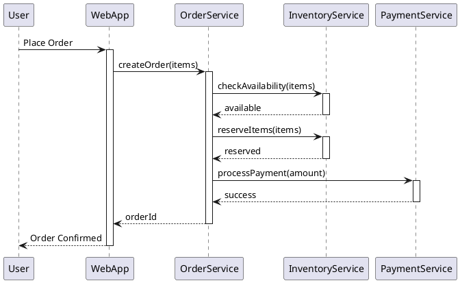

# Runtime View

> **Quick Summary**
> 
> **Purpose**: Show how building blocks **behave at runtime** - how they interact to fulfill key scenarios.
> 
> **Key Questions**:
> - How do components communicate at runtime?
> - What is the sequence of interactions for key features?
> - What happens during critical scenarios (errors, edge cases)?

---

---

**What to Document**

The runtime view describes the **dynamic behavior** of the system - how building blocks interact at execution time. Focus on important, interesting, or risky scenarios.

> **Important**: Don't try to document ALL scenarios. Focus on the ones that help stakeholders **understand the system**.

---

**What Makes a Good Runtime Scenario?**

| Document These | Skip These |
|----------------|------------|
| Main success paths | Simple CRUD operations |
| Complex business workflows | Obvious interactions |
| Error handling & recovery | Trivial getter/setter calls |
| Performance-critical paths | Implementation details |
| Integration with externals | Internal method calls |

---

**Scenario Selection**

**Example Scenarios to Document**

1. **Key Business Workflows**: "User places an order"
2. **System Startup/Shutdown**: "Application initialization sequence"
3. **Error Scenarios**: "Payment failure handling"
4. **Performance Critical**: "High-volume data processing"
5. **Security Flows**: "User authentication and authorization"

---

**Documentation Formats**

**Sequence Diagrams (Most Common)**

```
User        WebApp        OrderSvc      InventorySvc    PaymentSvc
 │            │              │               │               │
 │ Place Order│              │               │               │
 │───────────►│              │               │               │
 │            │ Create Order │               │               │
 │            │─────────────►│               │               │
 │            │              │ Check Stock   │               │
 │            │              │──────────────►│               │
 │            │              │◄── Available ─│               │
 │            │              │               │               │
 │            │              │ Reserve Items │               │
 │            │              │──────────────►│               │
 │            │              │◄── Reserved ──│               │
 │            │              │               │               │
 │            │              │ Process Payment               │
 │            │              │──────────────────────────────►│
 │            │              │◄────────── Success ───────────│
 │            │              │               │               │
 │            │◄── Order ID ─│               │               │
 │◄── Success │              │               │               │
 │            │              │               │               │
```

**PlantUML Sequence Diagram**



---

**Scenario Documentation Template**

```markdown
## Scenario: [Scenario Name]

**ID**: RT-001

**Description**: [What happens in this scenario?]

**Trigger**: [What initiates this scenario?]

**Preconditions**: 
- [What must be true before this scenario?]

**Actors/Components Involved**:
- [Component A] - [Role in this scenario]
- [Component B] - [Role in this scenario]

**Flow**:
1. [Step 1]
2. [Step 2]
3. [Step 3]

**Postconditions**:
- [What is true after this scenario?]

**Error Handling**:
- [What if step X fails?]
```

---

**Example: Order Processing Scenario**

```markdown
## Scenario: Place Order

**ID**: RT-001

**Description**: Customer places an order for items in their shopping cart.

**Trigger**: User clicks "Place Order" button

**Preconditions**: 
- User is authenticated
- Cart contains at least one item

**Actors/Components**:
- **Web Frontend** - Initiates request
- **API Gateway** - Routes and authenticates
- **Order Service** - Orchestrates workflow
- **Inventory Service** - Manages stock
- **Payment Service** - Processes payment
- **Notification Service** - Sends confirmations

**Flow**:
1. Frontend sends order request to API Gateway
2. Gateway validates token, routes to Order Service
3. Order Service validates order data
4. Order Service calls Inventory Service to reserve items
5. Order Service calls Payment Service to charge customer
6. On success: Order Service publishes OrderCreated event
7. Notification Service sends order confirmation email
8. Order Service returns order ID to frontend

**Error Handling**:
- **Inventory unavailable**: Return error, no charge
- **Payment fails**: Release reserved inventory, return error
- **Notification fails**: Log error, order still succeeds (async retry)
```

---

**Error/Exception Scenarios**

**Example: Payment Failure Handling**

```
OrderService     PaymentService     InventoryService     User
     │                 │                   │              │
     │ processPayment()│                   │              │
     │────────────────►│                   │              │
     │                 │ Payment Declined  │              │
     │◄───── ERROR ────│                   │              │
     │                 │                   │              │
     │ rollback()      │                   │              │
     │─────────────────────────────────────►              │
     │                 │◄─── Items Released │              │
     │                 │                   │              │
     │                 │                   │ Payment Failed
     │─────────────────────────────────────────────────────►│
     │                 │                   │              │
```

---

---

**📝 Tips and Best Practices**

| Tip | Description | Style |
|-----|-------------|-------|
| 6-1 | Focus on **important scenarios** only | ⭐ Essential |
| 6-2 | Use **sequence diagrams** as primary notation | ⭐ Essential |
| 6-3 | Document **error scenarios** not just happy paths | ⭐ Essential |
| 6-4 | Show **async vs sync** interactions clearly | ⭐ Essential |
| 6-5 | Include **timing constraints** if relevant | 📚 Thorough |
| 6-6 | **Name scenarios** clearly | ⭐ Essential |
| 6-7 | Select scenarios that **reveal architecture** | ⭐ Essential |
| 6-8 | Show **data passed** between components | 📚 Thorough |
| 6-9 | Keep diagrams at **appropriate abstraction** | 🏃 Lean |
| 6-10 | **Combine** diagrams with textual description | ⭐ Essential |
| 6-11 | Show **technology/protocol** used (REST, gRPC, events) | 📚 Thorough |

**Style Legend**: 🏃 Lean | ⭐ Essential | 📚 Thorough

---

---

**❌ Common Mistakes to Avoid**

**❌ Don't do this:**

1. Documenting every single interaction
2. Mixing different abstraction levels
3. Forgetting error handling scenarios
4. Sequence diagrams without explanations
5. Too much detail (implementation level)

**✅ Do this instead:**

1. Select architecturally significant scenarios
2. Each diagram focuses on one scenario
3. Always include key error scenarios
4. Add textual descriptions with every diagram
5. Stay at component level, not method level

---

**✅ Runtime View Checklist**

| ✓ | Item | Status |
|---|------|--------|
| ☐ | Key business scenarios documented | |
| ☐ | Error handling scenarios included | |
| ☐ | Sequence diagrams created | |
| ☐ | Textual descriptions provided | |
| ☐ | Async/sync interactions clarified | |
| ☐ | Building block names match Section 5 | |

---

---

**🔗 Related Sections**

- [Section 5: Building Blocks](arc42_05_building_blocks.md) - Static structure that runtime uses
- [Section 8: Concepts](arc42_08_concepts.md) - Cross-cutting runtime concerns
- [Section 10: Quality](arc42_10_quality.md) - Quality scenarios

---

---

**📖 Further Reading**

- [arc42 Tips for Section 6](https://docs.arc42.org/section-6/)
- [UML Sequence Diagrams](https://www.uml-diagrams.org/sequence-diagrams.html)
- [PlantUML Sequence Syntax](https://plantuml.com/sequence-diagram)
